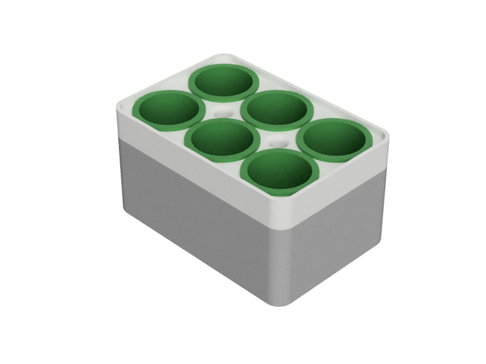

# Project Pink Cornflower

A self-watering tray for wildflowers.

[Fusion 360 CAD files](https://a360.co/2TBmJan)

Oliver Frolovs, 2019

Files:

* `.stl` files are stereolithography files for 3D printing. They are a direct export from the `Fusion 360` model.
* `.3mf` files are `Cura Ultimaker` project files
* `.gcode` files are `Cura Ultimaker` output to be printed
* `.dxf` files are direct export of MDF box surfaces from `Fusion 360` model

The 3D printing workflow for *each* of the parts is the following:

* A solid body is exported as `stl` file from the `Fusion 360` model
* An `stl` file is imported into `Ultimaker Cura`, the printing parameters are set
* The `gcode` numerical control instructions file is saved from `Ultimaker Cura`
* The `3mf` project file is saved from `Ultimaker Cura` to have a record of parameters used

General Wisdom:

* MDF must be primed with solvent-based primer to prevent surface damage

Useful links:

* [Dulux Pick Your Colour Palette](https://www.dulux.co.uk/en/colour-details/)

Some Estimates:

* [Dulux Primer for Wood](https://www.dulux.co.uk/en/products/primer-undercoat-wood) covers 16 m^2 per litre. So, a 250 ml can covers 4 m^2.

## MDF parts

Defined in the `Fusion 360` model, referenced above.

All parts:
* To be laser cut on [Trotec SP1500](https://www.troteclaser.com/en-gb/trotec-laser-machines/laser-cutters-sp-series/)
* v36 kerf 0.13 mm

## 3D printed parts

Defined in the `Fusion 360` model, referenced above.

All parts:
* Ultimaker Cura 2+
* PLA 0.4 mm nozzle

### Plant Pot.stl v36
* Layer Height 0.15
* Infill 20%
* Quantity x6
* Build plate adhesion
* 12 hours estimated
* 11.34 m, 90 g material

### Top.stl v36
* Layer Height 0.1
* Infill 20%
* Quantity x1
* 14 hours estimated
* 8.53 m, 67 g material

### Tray.stl v36
* Layer Height 0.1
* Infill 20%
* Quantity x1
* 23 hours estimated
* 13 m, 101 g material
